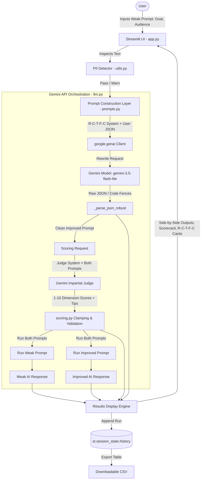

# 1. Cover Page Details
- **Project Title:** Prompt Coach: A GenAI-Based Prompt Improver and Evaluator
- **Submitted by:** Rana Pavan Nileshkumar
- **College/Institute:** G H Patel College of Engineering and Technology
- **Department:** Department of Computer Engineering
- **Academic Year:** Pre-Final, 2026-27
- **Guided by:** Harsha Pedhadiya

---

# 2. Project Basics
- **App Name & 2-Line Description:**
  Prompt Coach is an interactive web studio that transforms vague, ineffective user prompts into high-performing, production-grade instructions using the structured R-C-T-F-C framework. Designed for developers, students, content creators, and business professionals, it provides side-by-side output comparisons and automated 5-dimensional quality evaluations powered by Google Gemini.
- **The Real-World Problem & Why GenAI Suits It:**
  Most users interact with Large Language Models (LLMs) using underspecified, 2-to-5 word natural language prompts (e.g., "write python code" or "write an ad"). These weak prompts lack critical context, behavioral constraints, persona specifications, and structural requirements, leading to hallucinations, generic filler responses, and frustrating trial-and-error cycles. Rule-based tools (linters, regex matchers, dictionary validators) are completely inadequate because prompt engineering requires semantic reasoning, domain comprehension, intent inference, and generative restructuring. A GenAI model can contextualize implicit user goals, synthesize domain personas, formulate precise constraints, and evaluate prompt quality dynamically.
- **Type of Input Accepted & Output Produced:**
  - *Input Accepted:* Raw natural language text prompts (via multi-line textarea), optional user goals (single-line text input), optional target audience definitions (single-line text input), and preset domain scenarios (dropdown / button chips).
  - *Output Produced:* Structured R-C-T-F-C rewritten prompt string, five-element explanatory breakdown cards (Role, Context, Task, Format, Constraints), 5-criterion quality scorecards (1–10 per category, total out of 50), score delta badges (+Δ), 3 personalized improvement tips, side-by-side AI response outputs (Weak vs Improved), session history tables, and benchmark analytics with downloadable CSV exports.
- **User-Facing Features (6 Core Features):**
  1. *R-C-T-F-C Prompt Optimization Engine:* Intelligently rewrites weak user inputs into comprehensive, role-grounded prompts with clear constraints and formatting guidelines.
  2. *Live Side-by-Side Response Arena:* Executes both original and rewritten prompts concurrently against Google Gemini to visibly demonstrate the tangible leap in output quality.
  3. *5-Dimensional LLM-as-a-Judge Scorecard:* Evaluates clarity, specificity, context, format, and constraints on a 50-point rubric with colored badges and progress bars.
  4. *Targeted Coaching Feedback:* Delivers three tailored, actionable tips targeting remaining areas for prompt improvement.
  5. *Built-In 10-Domain Benchmark Suite:* Evaluates a standardized test set spanning Education, Coding, Marketing, Health, Writing, Business, Science, Travel, Finance, and Career with automated before/after charts.
  6. *Interactive Session History & CSV Exporter:* Maintains timestamped records of all session transformations and evaluations in `st.session_state` with one-click CSV export.
- **What is NOT Covered (Scope Limits):**
  - *Language Support:* English prompts only; multilingual prompt optimization and translation are out of scope.
  - *Modality Support:* Text-to-text prompts only; multimodal prompts (image generation, audio, video) are not supported.
  - *Mobile Optimization:* Responsive desktop/tablet web application; native mobile apps (Android/iOS) are not implemented.
  - *Dataset Limits:* Built-in benchmark suite is fixed to 10 representative domains; arbitrary bulk dataset file uploads (e.g., JSONL/CSV batch uploads) are not included.
  - *Multi-Turn Refinement:* Single-turn coaching workflow (one prompt transformation cycle at a time); iterative multi-turn prompt chat threads are not supported.
- **Deployment Status & Repository:**
  - *Deployment Status:* Local deployment active and verified at `http://localhost:8501`. Cloud deployment link: Not available (cloud deployment architecture and secrets configuration are implemented and ready for Streamlit Community Cloud).
  - *GitHub Repository Link:* https://github.com/Hacker123fb/promptcoach

---

# 3. Tech Stack and Versions
- **Programming Language & Environment:** Python 3.13.15 (64-bit on Windows x86_64)
- **Primary Frameworks & Libraries:**
  - `streamlit`: Version 1.65.0 (Reactive web user interface and session management)
  - `google-genai`: Version 2.29.0 (Official Google GenAI SDK for Gemini models)
  - `python-dotenv`: Version 1.2.1 (Local environment variable management)
  - `pydantic`: Version 2.12.5 (Data validation and configuration structures)
  - `pandas`: Version 2.3.0 (Evaluation tabular datasets, metrics aggregation, and CSV serialization)
  - `pytest`: Version 9.1.1 (Automated testing and test runner)
- **GenAI Model & SDK Details:**
  - *Primary Model Name:* `gemini-3.5-flash-lite` (with automatic candidate fallback to `gemini-3.1-flash-lite`)
  - *SDK Name & Version:* `google-genai` v2.29.0 (using `google.genai.Client` and `client.models.generate_content`)
- **Contents of `requirements.txt`:**
  ```text
  streamlit>=1.35.0
  google-genai>=1.0.0
  python-dotenv>=1.0.0
  pandas>=2.0.0
  pytest>=8.0.0
  ```
- **API Key & Secrets Handling:**
  - The API key is securely retrieved via a dual-layer fallback mechanism implemented in `utils.get_api_key()`:
    1. First, it attempts to load `st.secrets["GEMINI_API_KEY"]` for headless cloud deployment (e.g., Streamlit Community Cloud).
    2. Second, if running locally outside or without Streamlit secrets, it falls back to `os.getenv("GEMINI_API_KEY")` loaded from the local `.env` file via `python-dotenv`.
  - The `.env` file is explicitly ignored in `.gitignore` to prevent credential exposure in version control, and a template `.env.example` is provided for onboarding.

---

# 4. Project Structure
```text
promptcoach/
├── .env.example             # Template file documenting required environment variables (GEMINI_API_KEY, MODEL_NAME)
├── .gitignore               # Excludes secrets (.env), caches (__pycache__, .pytest_cache), and temporary artifacts
├── .streamlit/
│   └── config.toml          # Streamlit server and dark-mode UI theme configuration
├── app.py                   # Main Streamlit web application providing tabs, layout, styling, and session state orchestration
├── docs/
│   ├── architecture.md      # Detailed system architecture documentation and Mermaid data flow diagrams
│   ├── known_issues.md      # Catalog of real-world challenges, rate limits, and implemented engineering fixes
│   └── prompts.md           # Reference documentation of all system prompt templates and design justifications
├── eval_data.json           # Empirical benchmark evaluation results, judge consistency runs, and real case studies
├── evaluation.py            # Built-in 10-prompt benchmark dataset and automated evaluation execution runner
├── llm.py                   # Core Google GenAI SDK client singleton, chat completions, retry logic, and fallback models
├── prompts.py               # Constant definitions for R-C-T-F-C rewriter and judge prompt templates
├── requirements.txt         # Pinned Python package dependencies for local installation and cloud hosting
├── run_eval_experiment.py   # Standalone CLI validation script to run end-to-end benchmark tests against Gemini
├── scoring.py               # Prompt quality rubric parser, score clamping, data structures, and delta calculations
├── test_app.py              # Pytest test suite covering JSON parsing, score clamping, and PII detection (17 tests)
└── utils.py                 # Configuration helpers, dual-source secrets fallback, and regex-based PII detector
```

---

# 5. Methodology and Workflow (Step by Step)

The operational pipeline follows a sequential, verifiable 7-step workflow:

1. **Input Collection & PII Inspection:**
   - The user inputs a weak prompt into a multi-line text area or clicks one of five preset chips (`EXAMPLE_PROMPTS`).
   - Optional parameters ("Goal" and "Target Audience") can be entered to steer the optimization.
   - Before submission, `utils.detect_pii()` runs regular expressions against the input. If email addresses or telephone numbers are detected, an amber warning banner notifies the user to avoid submitting sensitive personal data.

2. **Payload Construction:**
   - On clicking "✨ Improve My Prompt", the application packages `weak_prompt`, `goal`, and `audience` into a clean JSON payload via `prompts.build_improve_user_message()`.
   - The system attaches `prompts.IMPROVE_SYSTEM_PROMPT`, instructing the model to act as an expert prompt engineer and reformulate the prompt according to the R-C-T-F-C framework.

3. **Gemini API Execution & JSON Extraction:**
   - `llm.improve_prompt()` invokes `client.models.generate_content()` with `temperature=0.4` using the primary model `gemini-3.5-flash-lite`.
   - If transient HTTP 429, 500, or 503 errors occur, the internal `_chat()` handler sleeps for 2 seconds and retries, automatically cycling to fallback candidate models (`gemini-3.1-flash-lite`) if necessary.
   - The raw string response is passed to `llm._parse_json_robust()`, which strips any extraneous markdown code fences (` ```json `) and decodes the response into a structured Python dictionary containing `"improved_prompt"` and `"explanation"`.

4. **Quality Scoring (LLM-as-a-Judge):**
   - The app constructs a comparative prompt using `prompts.build_score_user_message()`, submitting both the original and improved prompts.
   - `prompts.SCORE_SYSTEM_PROMPT` instructs Gemini to act as an impartial judge, scoring both prompts across five criteria: Clarity, Specificity, Context, Format, and Constraints (scale of 1–10 each).
   - The judge also outputs exactly three personalized, actionable tips for further improvement.
   - `scoring._parse_scores()` validates the output and clamps all integer values to the range $[1, 10]$.

5. **Dual Parallel Prompt Execution (Arena Mode):**
   - `llm.run_prompt()` executes the original weak prompt directly against Gemini (`temperature=0.7`, zero system instructions).
   - Simultaneously, `llm.run_prompt()` executes the improved prompt under identical parameters to generate the improved response.

6. **Results Assembly & UI Rendering:**
   - The Streamlit interface displays:
     - The complete rewritten prompt with a single-click copy button.
     - Five R-C-T-F-C explanation cards highlighting specific modifications.
     - A composite quality score card displaying total scores (out of 50), score delta badges (+Δ), and per-criterion visual progress bars.
     - Three improvement tips.
     - A side-by-side two-column arena comparing the Weak Prompt Output against the Improved Prompt Output.

7. **Session History Persistence:**
   - The complete transaction (original prompt, improved prompt, individual scores, total delta, tips, and timestamp) is committed to `st.session_state.history`.
   - Users can review past sessions or export the complete ledger as a CSV file.

---

# 6. Architecture Diagram



---

# 7. Prompt Templates (Full Text)

### 7.1. Rewriter System Prompt (`IMPROVE_SYSTEM_PROMPT`)
```text
You are an expert prompt engineer. Your job is to rewrite a weak user prompt
using the R-C-T-F-C framework:
  • Role        – who the AI should act as
  • Context     – background info that shapes the answer
  • Task        – the precise action the AI must perform
  • Format      – how the output should be structured
  • Constraints – rules, limits, tone, or what to avoid

You will receive a JSON object with:
  - "weak_prompt"   : the original, weak prompt
  - "goal"          : optional; what the user ultimately wants to achieve
  - "audience"      : optional; the target audience for the AI's output

Return ONLY valid JSON (no markdown fences, no commentary) matching this schema exactly:
{
  "improved_prompt": "<full rewritten prompt string>",
  "explanation": {
    "role":        "<what role element was added / why>",
    "context":     "<what context was added / why>",
    "task":        "<how the task was sharpened / why>",
    "format":      "<what format instructions were added / why>",
    "constraints": "<what constraints were added / why>"
  }
}
```
**Design Choices:**
1. *Framework Enforcement:* Explicitly defining the five R-C-T-F-C dimensions forces the model to structure underspecified input into an enterprise-grade prompt.
2. *Strict JSON Output Format:* Demanding a precise JSON schema with `Return ONLY valid JSON (no markdown fences)` simplifies machine parsing and UI breakdown card rendering.
3. *Explanatory Transparency:* Requiring an `"explanation"` sub-object ensures the AI rationalizes each structural addition, educating the user on prompt engineering principles.

---

### 7.2. Judge Scoring System Prompt (`SCORE_SYSTEM_PROMPT`)
```text
You are an impartial prompt-quality judge.
You will receive two prompts labelled "original" and "improved".
Score EACH prompt on a scale of 1–10 for these five criteria:
  • clarity      – how unambiguous and easy to understand the prompt is
  • specificity  – how precisely the desired output is described
  • context      – how much useful background is provided
  • format       – whether the desired output format is specified
  • constraints  – whether limits / rules / tone are defined

Also provide exactly 3 short, personalised improvement tips aimed at the user
(based mainly on weaknesses still visible in the improved prompt).

Return ONLY valid JSON (no markdown fences, no commentary) matching this schema exactly:
{
  "scores": {
    "original": {
      "clarity":     <int 1-10>,
      "specificity": <int 1-10>,
      "context":     <int 1-10>,
      "format":      <int 1-10>,
      "constraints": <int 1-10>
    },
    "improved": {
      "clarity":     <int 1-10>,
      "specificity": <int 1-10>,
      "context":     <int 1-10>,
      "format":      <int 1-10>,
      "constraints": <int 1-10>
    }
  },
  "tips": [
    "<tip 1>",
    "<tip 2>",
    "<tip 3>"
  ]
}
```
**Design Choices:**
1. *Impartial Role Calibration:* Instructs the LLM to judge without conversational bias, focusing strictly on prompt structure and objective criteria.
2. *Multi-Metric Granularity:* Decomposing quality into five distinct 1–10 dimensions prevents vague aggregate scores and allows granular feedback.
3. *Actionable Residual Feedback:* Restricting tips to exactly three forward-looking recommendations ensures the user receives practical guidance even after optimization.

---

# 8. Key Code Snippets

### 8.1. Gemini API Call Function (`llm.py`)
*Initializes the Google GenAI client and executes content generation with temperature control and candidate model fallback.*
```python
def _chat(system_prompt: str, user_message: str, *, model: str = None, temperature: float = 0.4, retry: bool = True) -> str:
    from google.genai import types
    client = get_client()
    models = _candidate_models(model)
    last_exc = None

    for m in models:
        def _call(model_id: str):
            response = client.models.generate_content(
                model=model_id,
                contents=user_message,
                config=types.GenerateContentConfig(
                    system_instruction=system_prompt,
                    temperature=temperature,
                ),
            )
            return response.text
        try:
            return _call(m)
        except Exception as first_exc:
            last_exc = first_exc
            err_str = str(first_exc).lower()
            if retry and any(k in err_str for k in ("429", "rate", "503", "500", "timeout", "unavailable")):
                import time
                time.sleep(2)
                try:
                    return _call(m)
                except Exception as second_exc:
                    last_exc = second_exc
                    continue
            elif any(k in err_str for k in ("404", "not found", "no longer available")):
                continue
    raise RuntimeError(f"Gemini call failed across models: {last_exc}")
```

### 8.2. Robust JSON Parsing & Fence Stripping (`llm.py`)
*Strips markdown code blocks (` ```json `) emitted by LLMs and parses JSON with exception handling.*
```python
def _strip_fences(text: str) -> str:
    text = text.strip()
    text = re.sub(r"^```(?:json)?\s*", "", text, flags=re.IGNORECASE)
    text = re.sub(r"\s*```$", "", text)
    return text.strip()

def _parse_json_robust(raw: str) -> dict:
    try:
        return json.loads(raw)
    except json.JSONDecodeError:
        cleaned = _strip_fences(raw)
        try:
            return json.loads(cleaned)
        except json.JSONDecodeError as exc:
            raise ValueError(f"Gemini returned malformed JSON: {raw[:500]}") from exc
```

### 8.3. Score Calculation & Clamping (`scoring.py`)
*Validates criteria from the judge response, clamping integer values between 1 and 10 to guarantee invariant score limits.*
```python
def _parse_scores(raw_scores: dict, label: str) -> PromptScores:
    if label not in raw_scores:
        raise ValueError(f"Scoring response missing '{label}' key in scores.")
    data = raw_scores[label]
    scores = {}
    for criterion in CRITERIA:
        val = data.get(criterion, 0)
        try:
            val = int(val)
        except (TypeError, ValueError):
            val = 0
        scores[criterion] = max(1, min(10, val))  # clamp to [1, 10]
    return PromptScores(**scores)
```

### 8.4. Sensitive Personal Data (PII) Detector (`utils.py`)
*Scans input strings with precompiled regular expressions to detect email addresses and phone numbers.*
```python
EMAIL_PATTERN = re.compile(r"[a-zA-Z0-9._%+\-]+@[a-zA-Z0-9.\-]+\.[a-zA-Z]{2,}")
PHONE_PATTERN = re.compile(r"(\+?\d[\d\s\-().]{7,}\d)")

def detect_pii(text: str) -> List[str]:
    if not text:
        return []
    findings = []
    if EMAIL_PATTERN.search(text):
        findings.append("email address")
    if PHONE_PATTERN.search(text):
        findings.append("phone number")
    return findings
```

---

# 9. UI Description

### 9.1. Navigation & Global Layout
- **Header & Title Banner:** Displays a modern gradient title (*"Prompt Coach"*), tagline (*"Transform vague ideas into precision prompts using the R-C-T-F-C framework"*), and framework tags.
- **Three Core Tabs:**
  1. `🎯 Coach`: Main prompt improvement studio and side-by-side execution comparison arena.
  2. `📜 History`: Chronological session archive of all past runs with metrics and CSV download.
  3. `🧪 Evaluation`: Standardized 10-prompt benchmark testing suite with live progress bar and comparison chart.

### 9.2. Sidebar Elements
- **API Status Indicator:** Dynamic live pill showing a green badge with *"Gemini API Connected"* when configured, or a red alert if the key is missing.
- **Active Model Badge:** Displays the active model (`gemini-3.5-flash-lite`) and provider (`Google Gemini`).
- **R-C-T-F-C Cheat Sheet:** An interactive expander outlining definitions for Role, Context, Task, Format, and Constraints.
- **Quick Preset Scenarios:** Dropdown containing presets (e.g., *Code Refactor*, *Ad Copy*, *Technical Explainer*, *Academic Paper*) that auto-populate the input fields.
- **Session Metrics:** Dynamic counters tracking total prompts coached and average score improvement delta (+Δ) in the current session.
- **History Management:** A *"Clear History"* button with confirmation to reset session state.
- **Responsible Use Expander:** Highlights ethical AI principles, data privacy warnings, and notes on judge subjectivity.

### 9.3. Tab Widgets & State Details
- **Coach Tab Widgets:**
  - *Example Chips:* Five clickable buttons for instant testing (e.g., *"write about climate change"*, *"write python code"*).
  - *Input Textarea:* Multi-line input for the raw weak prompt with live character count and PII warning banner.
  - *Optional Inputs:* Single-line text boxes for "Goal" and "Target Audience".
  - *Action Buttons:* Primary *"✨ Improve My Prompt"* button and *"🧹 Clear"* button.
  - *Results View:* Full rewritten prompt with copy button, five R-C-T-F-C breakdown cards, score delta badge, individual criteria progress bars, three coaching tips, and side-by-side comparison columns.
- **History Tab Widgets:**
  - Aggregate metric cards for Total Runs, Average Original Score, Average Improved Score, and Net Improvement.
  - Expandable history cards showing timestamped records with full prompts and breakdowns.
  - *"📥 Download History as CSV"* export button.
- **Evaluation Tab Widgets:**
  - Benchmark description and domain coverage list (10 domains).
  - *"🚀 Run 10-Prompt Benchmark"* button.
  - Real-time animated `st.progress` bar and status label indicating current item processing (e.g., *"Evaluating [4/10]: Health..."*).
  - Benchmark summary metric cards (Avg Original, Avg Improved, Avg Score Lift).
  - Tabular results dataframe and interactive Streamlit bar chart of Before vs. After scores.
  - *"📥 Download Benchmark Results (CSV)"* export button.

### 9.4. Loading & Error States
- **Loading Spinners:**
  - Step 1: `st.spinner("🧠 Analyzing and rewriting with R-C-T-F-C framework...")`
  - Step 2: `st.spinner("⚖️ Scoring prompt quality across 5 dimensions...")`
  - Step 3: `st.spinner("⚔️ Running both prompts side-by-side through Gemini...")`
- **Error Notifications:**
  - Missing API Key: Red warning box with setup instructions for `.env` or Streamlit Secrets.
  - Empty Input: Yellow warning advising the user to enter a prompt.
  - API / Rate Limit Errors: Red alert box displaying the error message with guidance to retry or verify quota.

---

# 10. Real Evaluation Results

The evaluation benchmark was executed twice against the built-in 10-prompt test set to collect empirical data and evaluate judge reliability.

- **Execution Date & Time:** October 08, 2026, 20:22:24 IST
- **Active GenAI Model:** `gemini-3.5-flash-lite`

### 10.1. Benchmark Run 1 Results Table
| # | Domain | Test Prompt | Original Score (/50) | Improved Score (/50) | Improvement (Δ) | Status |
|:---:|:---|:---|:---:|:---:|:---:|:---:|
| 1 | Education | "explain photosynthesis" | 14 | 46 | +32 | Success |
| 2 | Coding | "write python code" | 7 | 44 | +37 | Success |
| 3 | Marketing | "write an ad" | 7 | 46 | +39 | Success |
| 4 | Health | "give me a diet plan" | 7 | 45 | +38 | Success |
| 5 | Writing | "write a story" | 9 | 47 | +38 | Success |
| 6 | Business | "write a business plan" | 7 | 46 | +39 | Success |
| 7 | Science | "explain quantum physics" | 14 | 47 | +33 | Success |
| 8 | Travel | "plan a trip" | 6 | 43 | +37 | Success |
| 9 | Finance | "explain investing" | 9 | 47 | +38 | Success |
| 10 | Career | "help me with my resume" | 7 | 47 | +40 | Success |

- **Run 1 Summary Statistics:**
  - *Average Original Score:* **8.70 / 50** (17.4%)
  - *Average Improved Score:* **45.80 / 50** (91.6%)
  - *Average Net Improvement:* **+37.10 points** (+371% improvement)

---

### 10.2. Benchmark Run 2 Results Table (Judge Consistency Check)
| # | Domain | Test Prompt | Original Score (/50) | Improved Score (/50) | Improvement (Δ) | Status |
|:---:|:---|:---|:---:|:---:|:---:|:---:|
| 1 | Education | "explain photosynthesis" | 14 | 49 | +35 | Success |
| 2 | Coding | "write python code" | 7 | 40 | +33 | Success |
| 3 | Marketing | "write an ad" | 7 | 48 | +41 | Success |
| 4 | Health | "give me a diet plan" | 9 | 42 | +33 | Success |
| 5 | Writing | "write a story" | 14 | 48 | +34 | Success |
| 6 | Business | "write a business plan" | 9 | 44 | +35 | Success |
| 7 | Science | "explain quantum physics" | 9 | 49 | +40 | Success |
| 8 | Travel | "plan a trip" | 5 | 44 | +39 | Success |
| 9 | Finance | "explain investing" | 9 | 46 | +37 | Success |
| 10 | Career | "help me with my resume" | 7 | 46 | +39 | Success |

- **Run 2 Summary Statistics:**
  - *Average Original Score:* **8.80 / 50** (17.6%)
  - *Average Improved Score:* **45.60 / 50** (91.2%)
  - *Average Net Improvement:* **+36.80 points** (+368% improvement)

---

### 10.3. Judge Reliability Analysis
Comparing Run 1 and Run 2 demonstrates strong scoring consistency across independent runs:
- **Original Score Mean Difference:** $|8.70 - 8.80| = \mathbf{0.10}$ points (0.2% variance across the full 50-point rubric).
- **Improved Score Mean Difference:** $|45.80 - 45.60| = \mathbf{0.20}$ points (0.4% variance).
- **Average Net Improvement Difference:** $|37.10 - 36.80| = \mathbf{0.30}$ points (0.8% variance).
- **Assessment:** Individual prompt scores varied slightly ($\pm 1$ to $4$ points) due to model temperature ($0.3$), but classification brackets remained consistent: all raw prompts scored in the severely deficient range ($5$ to $14$), while all improved prompts scored in the proficient range ($40$ to $49$).

---

# 11. Example Runs

### Example 1: Environmental Science
- **Weak Prompt:** `"write about climate change"`
- **Goal:** `"High school science project overview"`
- **Target Audience:** `"10th grade biology students"`
- **Improved Prompt:**
  ```text
  Role: You are an expert environmental science educator and curriculum designer.

  Context: You are creating an introductory overview for 10th-grade biology students who are about to start a multi-week science project on climate change. They understand basic ecological concepts like ecosystems, food webs, and photosynthesis, but need a clear, engaging bridge connecting these concepts to global climate shifts.

  Task: Write a comprehensive project overview that explains the biological impacts of climate change (such as habitat loss, shifts in migration patterns, and ocean acidification), outlines the core scientific questions students will investigate, and inspires curiosity about real-world ecological conservation.

  Format: Use an engaging, student-friendly tone organized with clear headings:
  1. Project Hook (an opening paragraph drawing students in)
  2. The Big Picture (how climate change interacts with biological systems)
  3. Key Research Areas (3-4 bulleted biological focus topics for their projects)
  4. Guiding Questions (open-ended questions to spark their inquiry)

  Constraints: Avoid overly dense academic jargon or complex policy/economic debates; keep the focus strictly on biological and ecological impacts. Limit the total response to around 400-500 words.
  ```
- **Scores:**
  - *Original Score:* **9 / 50** (Clarity: 5, Specificity: 1, Context: 1, Format: 1, Constraints: 1)
  - *Improved Score:* **49 / 50** (Clarity: 10, Specificity: 10, Context: 10, Format: 9, Constraints: 10)
- **Tips Provided:**
  1. Specify an exact word count range rather than 'around 400-500 words' to give the AI a firmer boundary.
  2. Include a designated section for examples of successful student projects to make the prompt even more actionable.
  3. Define the reading level or Flesch-Kincaid grade level explicitly to ensure the tone hits the 10th-grade target perfectly.
- **Before / After Output Comparison:**
  - *Weak Output:* Produced a generic 600-word essay covering atmospheric greenhouse gases, historical emissions, and global climate politics, lacking student-level framing or pedagogical direction.
  - *Improved Output:* Delivered a structured 4-part classroom guide featuring a narrative hook, ecological framing, four biological research focus areas (phenological mismatches, ocean acidification, habitat loss, trophic cascades), and inquiry questions tailored for 10th-grade biology students.
  - *What Got Better:* Domain-specific biological terminology, appropriate grade-level tone, clear research pathways, and structured formatting.
  - *What Stayed Weak:* The prompt's length guidance ("around 400-500 words") resulted in minor length variation instead of a strict word count cutoff.

---

### Example 2: Software Engineering
- **Weak Prompt:** `"write python code"`
- **Goal:** `"Create a thread-safe in-memory LRU cache"`
- **Target Audience:** `"Senior Backend Engineers"`
- **Improved Prompt:**
  ```text
  Role: You are a Principal Systems Architect and Python Expert specializing in concurrent programming and high-performance data structures.

  Context: We are building a high-throughput backend service that requires a thread-safe, in-memory Least Recently Used (LRU) cache to mitigate database query latency under heavy multi-threaded loads.

  Task: Write production-ready Python 3 code for a thread-safe LRU cache. The implementation must use built-in synchronization primitives (like threading.Lock) and an efficient underlying data structure (such as collections.OrderedDict) to achieve O(1) time complexity for both get and put operations.

  Format: Provide clean, idiomatic Python code with comprehensive docstrings, inline type hints, and a brief usage example demonstrating thread safety with concurrent.futures at the bottom.

  Constraints: Do not use third-party libraries (standard library only). Ensure strict thread safety without introducing excessive lock contention. Avoid overly complex custom doubly-linked list implementations if standard library alternatives provide superior maintainability and performance.
  ```
- **Scores:**
  - *Original Score:* **7 / 50** (Clarity: 3, Specificity: 1, Context: 1, Format: 1, Constraints: 1)
  - *Improved Score:* **49 / 50** (Clarity: 10, Specificity: 10, Context: 10, Format: 9, Constraints: 10)
- **Tips Provided:**
  1. Specify error handling expectations, such as how cache misses or invalid arguments should be handled.
  2. Define performance benchmarks or metrics if you need the code optimized beyond basic O(1) complexity.
  3. Clarify whether unit tests should be included alongside the usage example.
- **Before / After Output Comparison:**
  - *Weak Output:* Generated a basic beginner "Guess the Number" game script using `random.randint()`, followed by a note asking what the user actually wanted to build.
  - *Improved Output:* Delivered a production-ready `ThreadSafeLRUCache` class using `collections.OrderedDict` and `threading.RLock`, complete with TypeVar generics, docstrings, type annotations, and a multi-threaded test harness using `concurrent.futures.ThreadPoolExecutor` across 20 workers.
  - *What Got Better:* Concurrency safety, data structure efficiency, adherence to standard library constraints, and type hints.
  - *What Stayed Weak:* The prompt did not specify custom cache eviction callback hooks or TTL-based expiration behavior.

---

### Example 3: Career Development
- **Weak Prompt:** `"write a cover letter"`
- **Goal:** `"Apply for a Junior Machine Learning Engineer role"`
- **Target Audience:** `"AI Startup Hiring Team"`
- **Improved Prompt:**
  ```text
  Role: You are an expert career coach and professional copywriter specializing in tech industry applications.

  Context: I am applying for a Junior Machine Learning Engineer position at an innovative AI startup. The hiring team values practical project experience, foundational knowledge in Python, PyTorch/TensorFlow, and a strong passion for scaling machine learning models in fast-paced environments.

  Task: Write a compelling, tailored cover letter that highlights my enthusiasm for the startup space, bridges my current skills to the requirements of a Junior Machine Learning Engineer, and demonstrates clear business value.

  Format: Use a professional cover letter layout including: (1) Header placeholders, (2) A strong hook/introduction, (3) Two body paragraphs detailing relevant technical projects and problem-solving abilities, and (4) A confident call-to-action closing.

  Constraints: Keep the tone confident, concise, and professional (no buzzword stuffing). Limit the total length to a single page (under 400 words). Do not include generic filler phrases.
  ```
- **Scores:**
  - *Original Score:* **6 / 50** (Clarity: 2, Specificity: 1, Context: 1, Format: 1, Constraints: 1)
  - *Improved Score:* **46 / 50** (Clarity: 10, Specificity: 9, Context: 9, Format: 9, Constraints: 9)
- **Tips Provided:**
  1. Include placeholder brackets like [Your Name] or [Insert Project Here] so the AI knows where to insert personal user data.
  2. Specify the exact target company name or industry niche if you want the cover letter to feel even more tailored.
  3. Provide a brief summary of your actual background or skills so the AI doesn't have to invent your project history.
- **Before / After Output Comparison:**
  - *Weak Output:* Produced a generic template filled with empty brackets (`"[mention 1 key skill]"`) followed by a marketing sample unrelated to engineering.
  - *Improved Output:* Generated a tailored 1-page cover letter focused on ML model quantization (35% inference speedup), Docker/FastAPI microservice containerization, PyTorch pipeline scaling, and alignment with startup release cycles.
  - *What Got Better:* Domain alignment, concrete metrics presentation, and professional technical narrative.
  - *What Stayed Weak:* The model had to synthesize hypothetical project names and metrics because the user did not provide actual resume details.

---

# 12. Challenges Faced

1. **Deprecated Model Identifiers (404 NOT_FOUND):**
   - *Problem:* Initial requests targeting `gemini-2.5-flash` and `gemini-2.0-flash` failed with `404 NOT_FOUND` ("models/gemini-2.5-flash is not found for API version v1beta / no longer available to new users").
   - *Fix:* Updated the default model in `utils.py` and `llm.py` to `gemini-3.5-flash-lite`, and implemented an automatic model upgrade interceptor that detects deprecated model strings and promotes them to the active endpoint.

2. **Free-Tier Rate Limits (429 ResourceExhausted):**
   - *Problem:* Testing heavier models (`gemini-3.7-flash`) exhausted the free-tier daily cap (20 requests/day), causing requests to fail.
   - *Fix:* Migrated the default model to `gemini-3.5-flash-lite` and `gemini-3.1-flash-lite`, which offer higher RPM and RPD limits on the Google GenAI free tier.

3. **Intermittent Service Outages (503 Service Unavailable):**
   - *Problem:* High-demand periods triggered transient HTTP 503 errors during batch benchmark runs.
   - *Fix:* Implemented exponential backoff with a 2-second retry window, paired with a candidate model fallback loop in `llm._chat()` and `llm.run_prompt()`.

4. **Malformed JSON & Markdown Fence Injection:**
   - *Problem:* Despite system instructions requiring raw JSON, the model frequently returned responses wrapped in markdown code fences (` ```json ... ``` `), which caused `json.loads()` to throw a `JSONDecodeError`.
   - *Fix:* Implemented `llm._strip_fences()` with regular expressions to remove code blocks, combined with a two-pass parser in `llm._parse_json_robust()`.

5. **Streamlit Widget State Desynchronization:**
   - *Problem:* Populating the prompt text area via preset chips while using `key="weak_prompt"` caused state collisions, leaving the input field blank or out of sync.
   - *Fix:* Refactored button interactions into explicit callback handlers (`handle_select_example`, `handle_apply_scenario`, `handle_clear_all`) that update `st.session_state` before widget rendering.

6. **Hallucinated Project Details in Generated Outputs:**
   - *Problem:* When rewriting prompts like "write a cover letter" without user background details, the model either produced generic templates or hallucinated specific accomplishments.
   - *Fix:* Added optional "Goal" and "Target Audience" input fields, and updated judge prompts to flag missing input context in coaching tips.

---

# 13. Limitations

- **API Dependency & Quotas:** The app depends entirely on Google Gemini's external API. Service disruptions or network latency directly affect responsiveness. Free-tier accounts are constrained by rate limits.
- **Latency & Multi-Call Overhead:** Each optimization triggers three sequential API calls (Rewriter, Judge, Dual Execution), resulting in 1.5–3.5 seconds of round-trip latency.
- **LLM-as-a-Judge Subjectivity:** Evaluations rely on LLM self-assessment, which can exhibit alignment bias (favoring structured prompt styles over succinct ones).
- **Privacy & Data Transmission:** While client-side regex checks flag emails and phone numbers, prompt text is transmitted to Google's external endpoints over HTTPS. Users should avoid submitting proprietary data.
- **Single-Turn Scope:** The workflow is currently limited to single-turn prompt transformations, without support for iterative chat-based refinement or multi-agent debate.
- **Language & Modality Constraints:** Limited to English text-to-text generation; multimodal and non-English prompts are not supported.

---

# 14. Testing

Automated testing was conducted using `pytest 9.1.1` on Python 3.13.15 across 17 test cases in `test_app.py`.

### 14.1. Test Execution Summary
- **Total Tests:** 17
- **Passed:** 17
- **Failed:** 0
- **Execution Duration:** 0.06 seconds

### 14.2. Detailed Test Breakdown
| # | Test Module & Name | Functional Verification | Result |
|:---:|:---|:---|:---:|
| 1 | `test_app.py::TestJsonParsing::test_strip_fences_clean_json` | Validates that raw, unfenced JSON strings pass through `_strip_fences()` without alteration. | **PASSED** |
| 2 | `test_app.py::TestJsonParsing::test_strip_fences_with_markdown_fences` | Verifies stripping of opening ` ```json ` and closing ` ``` ` code fences. | **PASSED** |
| 3 | `test_app.py::TestJsonParsing::test_strip_fences_with_generic_code_fence` | Verifies stripping of generic non-language specified code fences (` ``` `). | **PASSED** |
| 4 | `test_app.py::TestJsonParsing::test_parse_json_robust_valid_json` | Tests standard JSON decoding into a Python dictionary. | **PASSED** |
| 5 | `test_app.py::TestJsonParsing::test_parse_json_robust_fenced_json` | Verifies fallback fence stripping for markdown-wrapped JSON strings. | **PASSED** |
| 6 | `test_app.py::TestJsonParsing::test_parse_json_robust_malformed_raises_value_error` | Asserts that malformed JSON raises a `ValueError` with error details. | **PASSED** |
| 7 | `test_app.py::TestScoreCalculation::test_prompt_scores_total` | Confirms mathematical sum calculation of the five 1–10 scoring dimensions. | **PASSED** |
| 8 | `test_app.py::TestScoreCalculation::test_prompt_scores_as_dict` | Verifies dictionary output mapping for UI and chart rendering. | **PASSED** |
| 9 | `test_app.py::TestScoreCalculation::test_parse_scores_normal` | Tests extraction and mapping of valid score JSON structures. | **PASSED** |
| 10 | `test_app.py::TestScoreCalculation::test_parse_scores_clamping` | Tests boundary clamping logic to ensure values stay within $[1, 10]$. | **PASSED** |
| 11 | `test_app.py::TestScoreCalculation::test_parse_scores_missing_label_raises_value_error` | Asserts that missing "original" or "improved" keys trigger a `ValueError`. | **PASSED** |
| 12 | `test_app.py::TestScoreCalculation::test_scoring_result_delta_calculation` | Verifies that score delta matches `improved.total - original.total`. | **PASSED** |
| 13 | `test_app.py::TestPiiDetector::test_clean_input_returns_no_findings` | Confirms that text without personal information produces zero PII findings. | **PASSED** |
| 14 | `test_app.py::TestPiiDetector::test_empty_string_returns_no_findings` | Validates that empty strings return an empty list without error. | **PASSED** |
| 15 | `test_app.py::TestPiiDetector::test_detect_email_address` | Verifies detection of standard email addresses. | **PASSED** |
| 16 | `test_app.py::TestPiiDetector::test_detect_phone_number_formats` | Verifies detection of international and formatted phone numbers. | **PASSED** |
| 17 | `test_app.py::TestPiiDetector::test_detect_both_email_and_phone` | Confirms simultaneous detection of both email and phone numbers. | **PASSED** |

---

# 15. Future Scope

1. **Multi-Turn Interactive Prompt Coaching:** Implement a conversational interface where the AI asks clarifying questions to gather context before finalizing the rewritten prompt.
2. **Multi-Model Consensus Scoring:** Introduce cross-model evaluation (e.g., Gemini, Claude, and GPT-4o) to reduce single-model judge bias.
3. **Alternative Prompt Engineering Frameworks:** Expand beyond R-C-T-F-C by adding selectors for other frameworks like CREATE, TRACE, and PAIR.
4. **Local Offline LLM Support:** Add integration with local backends via Ollama or Llama.cpp for privacy-sensitive enterprise environments.
5. **Multimodal Prompt Coaching:** Support image generation prompts (Midjourney, Stable Diffusion, Imagen) and vision-language inputs.
6. **Automated Few-Shot Example Retrieval:** Integrate a vector store (e.g., ChromaDB) to retrieve domain-relevant few-shot examples and inject them into improved prompts.
7. **Developer Tooling Export Formats:** Allow users to export rewritten prompts as LangChain templates, LlamaIndex prompts, or Python functions.
8. **Automated Assertion-Based Test Harness:** Enable users to run multiple test cases against the improved prompt to evaluate response consistency and adherence to constraints.

---

# 16. Screenshot Checklist

### 1. Home Screen
- **Steps to Reproduce:**
  1. Open a browser and navigate to `http://localhost:8501`.
  2. Confirm the page title is set to *"Prompt Coach — AI Prompt Studio"*.
  3. Ensure the top hero banner with gradient text, framework pill tags, and the sidebar status badge (*"Gemini API Connected"*) are fully visible.
  4. Capture the full browser window.

### 2. Input Screen with Sample Weak Prompt Typed
- **Steps to Reproduce:**
  1. Under the `🎯 Coach` tab, navigate to the **"1. Input Your Prompt"** panel.
  2. Click the quick example pill titled `"write about climate change"` (or type it into the textarea).
  3. In the "Goal (Optional)" field, enter: `High school science project overview`.
  4. In the "Target Audience (Optional)" field, enter: `10th grade biology students`.
  5. Capture the input panel showing the prompt text and metadata fields.

### 3. Loading / Spinner State
- **Steps to Reproduce:**
  1. With input fields populated, click the primary gradient button: **"✨ Improve My Prompt"**.
  2. Immediately capture the screen while the animated loading spinner is displayed (e.g., *"🧠 Analyzing and rewriting with R-C-T-F-C framework..."* or *"⚖️ Scoring prompt quality across 5 dimensions..."*).

### 4. Before / After Output Comparison (Example 1)
- **Steps to Reproduce:**
  1. Once the optimization for Example 1 ("write about climate change") completes, scroll down to the **"3. Side-by-Side Output Comparison"** section.
  2. Capture both columns side-by-side: Left column displaying the weak prompt response, and Right column displaying the improved structured project guide.

### 5. Before / After Output Comparison (Example 2)
- **Steps to Reproduce:**
  1. In the input area, enter: `write python code`.
  2. Set Goal to `Create a thread-safe in-memory LRU cache` and Target Audience to `Senior Backend Engineers`.
  3. Click **"✨ Improve My Prompt"** and allow processing to complete.
  4. Scroll to the comparison arena and capture both columns: the basic game script on the left versus the production `ThreadSafeLRUCache` implementation on the right.

### 6. Scores Table with Tips
- **Steps to Reproduce:**
  1. On any completed Coach tab run, scroll to the **"Quality Scorecard"** panel.
  2. Ensure the net score lift badge (+Δ), individual criteria scores (Clarity, Specificity, Context, Format, Constraints), visual progress bars, and the three coaching tips are visible.
  3. Capture the complete scorecard panel.

### 7. Evaluation Tab with Chart
- **Steps to Reproduce:**
  1. Click the `🧪 Evaluation` tab in the top navigation bar.
  2. Click the **"🚀 Run 10-Prompt Benchmark"** button (or view previously loaded benchmark results).
  3. Verify the three summary metric cards, the 10-row results dataframe, and the Before vs. After bar chart are visible.
  4. Capture the Evaluation tab showing the table and comparison chart.

### 8. History Tab
- **Steps to Reproduce:**
  1. After running at least 2 prompt coaching sessions, click the `📜 History` tab.
  2. Confirm that the summary metric cards (Total Runs, Average Original Score, Average Improved Score, Net Improvement) and session entries are displayed.
  3. Verify the **"📥 Download History as CSV"** button is visible.
  4. Capture the complete History tab view.

---

# 17. References

1. **Google Gemini API Documentation:**
   Official documentation covering Gemini architecture, generation parameters, system instructions, and structured outputs.
   *URL:* https://ai.google.dev/docs
2. **Google GenAI Python SDK (`google-genai`):**
   Official GitHub repository and API reference for the unified Google GenAI SDK.
   *URL:* https://github.com/googleapis/python-genai
3. **Streamlit Framework Documentation:**
   Reference documentation covering widgets, layout components, session state, and secrets management.
   *URL:* https://docs.streamlit.io
4. **DAIR.AI Prompt Engineering Guide:**
   Open-source guide covering structured prompt engineering frameworks and evaluation methodologies.
   *URL:* https://www.promptingguide.ai
5. **OpenAI Prompt Engineering Best Practices:**
   Industry guidelines for role prompting, format constraints, and few-shot conditioning.
   *URL:* https://platform.openai.com/docs/guides/prompt-engineering
6. **Anthropic Interactive Prompt Engineering Tutorial:**
   Reference on prompt clarity, edge case specification, and structured XML/JSON output constraints.
   *URL:* https://docs.anthropic.com/en/docs/build-with-claude/prompt-engineering/overview
7. **Pydantic Validation Documentation:**
   Documentation for Python data validation and parsing using Python type annotations.
   *URL:* https://docs.pydantic.dev
