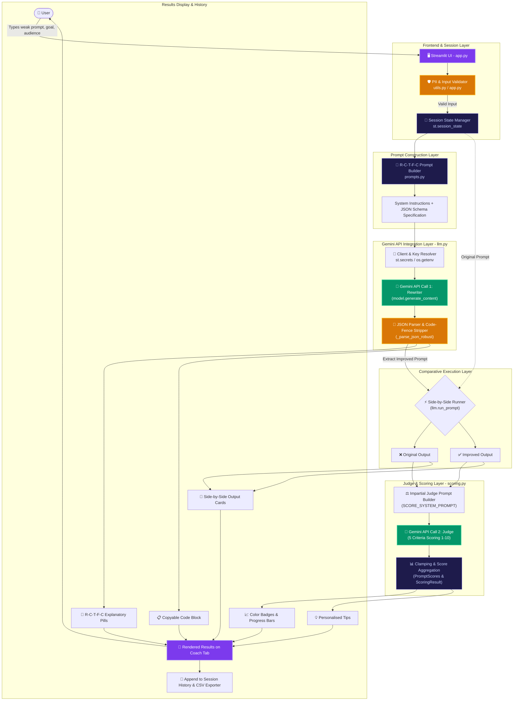

# 🏗️ Prompt Coach — System Architecture

This document describes the high-level system architecture, data flow, and module boundaries of the **Prompt Coach** application.

---

## 🔄 End-to-End Flowchart

---

## 🧩 Architectural Layers & Module Responsibilities

### 1. Presentation & State Layer (`app.py`)
- **Page Layout & Styling**: Dark-theme glassmorphism CSS, custom banners, cards, and tab system (`Coach`, `History`, `Evaluation`).
- **Reactive Workflow**: Drives step-by-step UI feedback via `st.spinner`, alerts, and metrics.
- **State Persistence**: Maintains run history and evaluation batch state in `st.session_state`.
- **Exporting**: Implements CSV streaming for both individual runs and benchmark suites.

### 2. Guardrails & Utilities Layer (`utils.py`)
- **PII Detector**: Evaluates inputs against email and telephone regex patterns before LLM dispatch, raising amber advisory warnings.
- **Secrets Resolver**: Provides unified fallback resolution: checks `st.secrets` (for Streamlit Community Cloud) first, then `os.getenv` / `.env` (for local environments).

### 3. Prompt Engineering Layer (`prompts.py`)
- **R-C-T-F-C System Template**: Instructs Gemini to act as a Prompt Engineer and rewrite prompts along Role, Context, Task, Format, and Constraints dimensions.
- **Judge System Template**: Instructs Gemini to act as an impartial referee, evaluating clarity, specificity, context, format, and constraints on a 1–10 integer scale.
- **Message Builders**: Serializes inputs into clean, normalized JSON structures.

### 4. API & Resilience Layer (`llm.py`)
- **Singleton Client**: Cached initialization of the `google.genai.Client`.
- **Error Recovery & Retries**: Detects transient HTTP 429/500/503 rate-limiting errors and automatically retries with exponential backoff.
- **Fenced JSON Normalizer**: Handles LLMs wrapping structured JSON output in triple-backtick markdown blocks by stripping fences and retrying parsing before throwing errors.

### 5. Scoring & Parsing Engine (`scoring.py`)
- **Data Models**: `PromptScores` and `ScoringResult` dataclasses encapsulate criterion totals and delta calculations.
- **Range Clamping**: Enforces $[1, 10]$ boundaries on all judge criteria scores to guard against LLM hallucination of invalid numbers.

### 6. Benchmark & Evaluation Suite (`evaluation.py`)
- **Domain Coverage**: 10 curated test cases spanning diverse subjects (Education, Coding, Marketing, Health, Writing, Business, Science, Travel, Finance, Career).
- **Batch Pipeline**: Sequentially triggers rewrites and evaluations while streaming live progress metrics to the UI.
